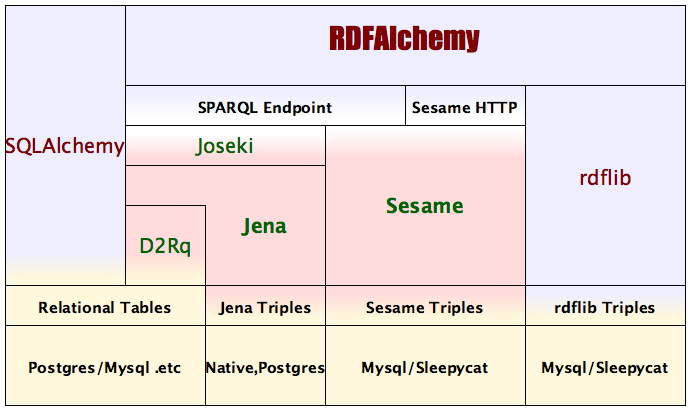

.. RDFAlchemy documentation master file, created by

Welcome to RDFAlchemy's documentation!
======================================

The goal of RDF Alchemy is to allow anyone who uses `python <http://www.python.org/>`_ to have a object type API access to an RDF Triplestore.  

The same way that:

  * `SQLAlchemy <http://www.sqlalchemy.org>`_ is an ``ORM`` (Object Relational Mapper) for relational database users
  * RDFAlchemy is an ``ORM`` (Object RDF Mapper) for semantic web users.

The use of persistent objects in RDFAlchemy will be as close as possible to what it would be in SQLAlchemy.  Code like:

.. code-block:: pycon

    >>> c = Company.query.get_by(symbol = 'IBM')
    >>> print(c.companyName)
    International Business Machines Corp.

This code does not change as the user migrates from SQLAlchemy to RDFAlchemy and back, lowering the bar for adoption of RDF based datastores.

Contents:

.. toctree::
   :maxdepth: 2

   orm
   crud
   sparql
   engines
   customizing_literals

FormAlchemy's RDFAlchemy extension
----------------------------------

Auto-generated, customizable HTML input form fields from your RDFAlchemy mapped classes. See
FormAlchemy's :mod:`support for RDFAlchemy <formalchemy:formalchemy.ext.rdf>`

"FormAlchemy eliminates boilerplate by autogenerating HTML input fields from a
given model. FormAlchemy will try to figure out what kind of HTML code should
be returned by introspecting the model's properties and generate ready-to-use
HTML code that will fit the developer's application."

Capabilities
------------

* SQLAlchemy interface
* Caching of data reads
* Access multiple datastores:
   * `rdflib <http://code.google.com/p/rdflib.net>`_ (beta)
   * `SPARQL <http://www.w3.org/TR/rdf-sparql-query/>`_ endpoints (**alpha**)
       * `Joseki <http://www.joseki.org/>`_ based Jena access (**alpha**)
       * `D2R-server <http://sites.wiwiss.fu-berlin.de/suhl/bizer/d2r-server/>`_ (**alpha**)
   * Access to RDF triples from SQL databases through D2Rq

News
----
  Trunk now includes:
  
  * Read/Write access for collections and containers
  * Read access to SPARQL endpoints
  * Read/Write access to Sesame2
  * Cascading delete
  * chained descriptors and predicate range->class mapping

Installation
------------
RDFAlchemy is now available at `Pypi <http://pypi.python.org/pypi>`_: Just type

.. code-block:: bash

    $ easy_install rdfalchemy

If you don't have setuptools installed...well you should so `go get it 
<http://peak.telecommunity.com/DevCenter/EasyInstall>`_.  Trust me.

Code
----
Browse dev code at http://bitbucket.org/gjhiggins/rdfalchemy-dev and see the current trunk and all history.

This is an actively developing project so bugs come and go. Get your svn access to the trunk at:

.. code-block:: bash

    $ hg clone http://bitbucket.org/gjhiggins/rdfalchemy-dev

User Group
-----------
You can now `visit rdfalchemy-dev <http://groups.google.com/group/rdfalchemy-dev>`_ at Google Groups.

Bugs can be reported at bitbucket.

API Docs
---------
There are epydoc API Docs at http://www.openvest.com/public/docs/rdfalchemy/api/. You can also use links there to browse source, but it might not be current with the trunk.

Samples
-------
There is a samples submodule where some classes like ``Foaf`` and ``Doap`` show 
sample usage of RDFAlchemy and a subdirectory of some rdf Schemes. 

Indices and tables
==================

* :ref:`genindex`
* :ref:`modindex`
* :ref:`search`

